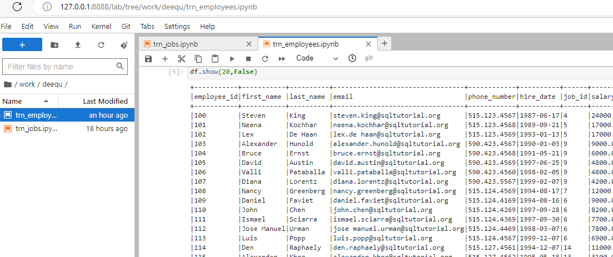

# DQE Module python project using pytest
Contains several DQE tests for TRN DB tables.
Docker container is used for executing pyspark-notebook and running tests. 
Includes usage of pyspark-notebook using PyDeequ library.
Contains examples of following tests
- data analyzing
- data profiling
- constraints suggestion
- constraints verification

Results are provided in pyspark-notebook in readable format.

## Project structure
- deequ folder - contains pyspark-notebook. Splitted by names of tables. 
- corelibs folder - additional core helpers (as of now only jdbs driver uploaded there)

## Preparing docker environment for tests execution
```bash
cd <project_folder>
##prepare docker image to run jupyter pyspark-notebooks
###using old spark version:3 from history
docker build --rm --force-rm -t jupyter/pyspark-notebook:spark-3.0.0 . --build-arg spark_version=3.0.0 --build-arg hadoop_version=3.2 --build-arg spark_checksum=bfe45406c67cc4ae00411ad18cc438f51e7d4b6f14eb61e7bf6b5450897c2e8d3ab020152657c0239f253735c263512ffabf538ac5b9fffa38b8295736a9c387 --build-arg openjdk_version=8
##prepare docker container 
docker run -v %cd%:/home/jovyan/work -p 8888:8888 -p 4040:4040 --user root -e JUPYTER_ENABLE_LAB=yes --name pyspark jupyter/pyspark-notebook:spark-3.0.0
##NEXT STEPS
### after container is created, take the link to server using string "To access the server, open this file in a browser .. Or copy and paste one of these URLs"
## open provided link in browser
```

## Notebook usage 
after container is created
 - take the link to server using string "To access the server, open this file in a browser .. Or copy and paste one of these URLs"
 - open provided link in browser
 - select notebook and update/rerun if needeed 
 - 

